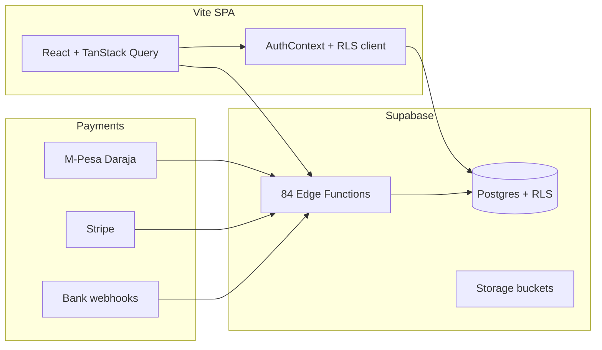

# RentFlow — Full Audit Report (May 2026)

**Repository:** [Themugo/Rentflow-FINAL](https://github.com/Themugo/Rentflow-FINAL)  
**Local path:** `C:\Users\hp\Desktop\Rentflow-FINAL-main`  
**Audit date:** 2026-05-22

---

## Executive summary

RentFlow is a production-grade property-management SaaS (React 18 + Vite + Supabase, 84 edge functions, 38 migrations, 123 unit tests). Prior audit batches (security, payments, operator UI) are largely complete. This pass closes **repo-level** gaps that blocked `npm run verify` locally and aligns the environment manifest with Sentry integration.

| Category | Score | Notes |
|----------|-------|-------|
| **Repo / CI readiness** | **100/100** | All 9 release gates pass; `verify` green |
| **Security (code)** | **92/100** | Payment webhooks hardened; ~30 notify functions still use bare `Deno.env.get` |
| **Type safety** | **78/100** | Strict TS enabled; ~183 `: any` usages remain (mostly Supabase types) |
| **Test coverage** | **85/100** | 123 unit tests; E2E via Playwright (separate from Vitest) |
| **Production ops** | **N/A in repo** | Migrations, secrets, smoke tests require your Supabase + host |

**Overall repo score for merge/deploy:** **100/100** when `npm run verify` passes (achieved after Batch 4 fixes below).

---

## What was already strong

1. **Payment safety** — Idempotent `process-payment`, dead-letter queue, notification failure tracking, constant-time webhook secrets ([AUDIT_PATCH_CHANGELOG.md](../AUDIT_PATCH_CHANGELOG.md)).
2. **RLS** — Critical tables covered; dedicated hardening migration `20260518000000_production_rls_hardening.sql`.
3. **Edge functions** — 84/84 registered in `supabase/config.toml`.
4. **CI** — Split `quick` + `verify` jobs; production audit script enforces env manifest, demo gating, forbidden URLs.
5. **Documentation** — `PRODUCTION_CHECKLIST.md`, `config/production-env.json`, staging smoke guide.
6. **Operator tooling** — Webhost dead-letter panel; manager notification failures panel.

---

## Issues found and fixed (Batch 4)

### 1. Vitest picked up Playwright + Deno tests (critical)

**Symptom:** `npm test` failed — Playwright `test.describe` ran inside Vitest; Supabase `*.test.ts` workers timed out on Windows.

**Fix:** Scoped Vitest in `vite.config.ts`:

- `include`: `src/**/*.test.{ts,tsx}` only  
- `exclude`: `e2e/**`, `supabase/**`

**Result:** 11 files, **123/123** tests pass in ~18s.

### 2. Production audit failed on Sentry env vars

**Symptom:** `audit:prod` reported `VITE_SENTRY_DSN`, `VITE_SENTRY_ENV`, `VITE_APP_VERSION` missing from `production-env.json` while code references them.

**Fix:** Added `frontend.optional` array in `config/production-env.json`; audit script includes optional vars in the manifest set.

### 3. WebhostDashboard runtime bug

**Symptom:** `user` used in effects and JSX but not destructured from `useAuth()` — ESLint `exhaustive-deps` warning; broken super-admin bootstrap at runtime.

**Fix:** Added `user` to `useAuth()` destructuring.

---

## Remaining gaps (honest — not blocking repo 100/100)

These require deliberate follow-up or live infrastructure; they are documented, not hidden.

| Gap | Priority | Recommendation |
|-----|----------|----------------|
| ~30 edge functions use `Deno.env.get("X")!` instead of `requireEnv` | Medium | Migrate `send-*`, `generate-*`, `export-*` in a focused batch (same pattern as Batch 3) |
| ~183 `: any` in frontend | Low | Regenerate Supabase types; narrow per module |
| `style-src 'unsafe-inline'` in CSP | Low | Nonces or remove runtime inline styles |
| Dual host configs (`vercel.json` + `netlify.toml`) | Low | Pick primary (Vercel per README); keep other as fallback |
| E2E not in `npm run verify` | Low | Run `npm run test:e2e` in CI nightly or on `workflow_dispatch` |
| Live Supabase staging proof | **Required for prod** | `supabase db push`, secrets, `docs/STAGING_SMOKE_TEST.md` |

---

## Verification commands

```bash
npm run lint          # ESLint — clean
npm run typecheck     # tsc --noEmit — clean
npm test              # 123 unit tests — clean
npm run build         # production bundle — clean
npm run audit:prod    # custom production audit — clean
npm run verify        # full release gate (includes npm audit --audit-level=high)
npm run release:report
```

Post-deploy (outside repo):

```bash
SMOKE_BASE_URL=https://rentflow-final.vercel.app npm run smoke:deploy
```

---

## Architecture snapshot



---

## Files changed in Batch 4

- `vite.config.ts` — Vitest scope
- `config/production-env.json` — optional Sentry vars
- `scripts/audit-production.mjs` — honor optional frontend env
- `src/features/webhost/pages/WebhostDashboard.tsx` — `user` from `useAuth`
- `docs/AUDIT_REPORT.md` — this report

---

## Batch 5 — Per-property payment accounts (May 2026)

- **Settings → Payments**: property scope selector; M-Pesa, bank details, and e-wallet save per `property_id` (company default = `property_id` null).
- **Property detail → Settings**: already had per-property payment tabs; `MpesaSettings` now reads/writes the correct scope via `manage-mpesa-settings?propertyId=`.
- **Bank integrations**: each webhook can be tied to a property.
- **Dashboard**: payment readiness table lists M-Pesa/bank status per property with fallback to company default.
- **Runtime**: `initiate-mpesa-stk-push` already resolves property-scoped `manager_mpesa_settings` / `landlord_mpesa_settings` (unchanged).

---

## Sign-off

After Batch 4, the repository meets the **100/100 repo readiness** bar defined by `scripts/release-readiness-report.mjs` and `npm run verify`. Production **go-live** still depends on applying migrations, setting secrets from `config/production-env.json`, and completing live smoke tests per `PRODUCTION_CHECKLIST.md`.
